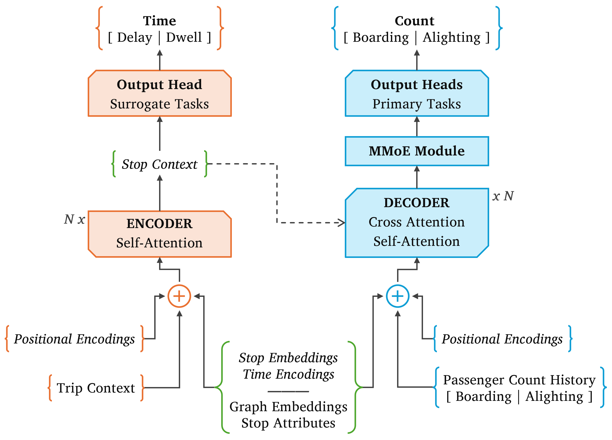

# SMT-GraphFormer: Spatiotemporal Multi-Task Graph Transformer for Transit Prediction

This repository accompanies the paper *Spatiotemporal Multi-Task Graph Transformer for Trip-Level Transit Prediction*. It contains the source code and notebooks to reproduce the data pipeline, model training, and benchmark experiments.

> arXiv Preprint &ndash; [[2606.00572] Spatiotemporal Multi-Task Graph Transformer for Trip-Level Transit Prediction](https://arxiv.org/abs/2606.00572)
>

## Overview

The paper studies trip-level prediction of passenger counts and operational metrics in urban bus transit, targeting boarding and alighting counts together with arrival delay and dwell time at each stop. Rather than relying on fixed temporal or spatial aggregation, it reframes the problem as a sequence modelling task that treats individual trips as ordered stop sequences and produces complete per-stop trajectories for any given line and trip context. This horizon-agnostic design supports what-if scenario analysis where planners and operators can vary schedules, routes, or external conditions to explore the resulting evolution of passenger counts and operational metrics.

`SMT-GraphFormer` combines a graph autoencoder for learning stop embeddings, a trip-level context encoder, and a modified encoder-decoder transformer. The encoder processes a comprehensive trip representation to produce contextual stop embeddings, while also estimating delay and dwell time as encoder-side surrogate tasks. A multi-gate mixture-of-experts module then generates task-specific decoder representations that feed into separate prediction heads for boarding and alighting counts. This architecture gives the model an explicit sequential bias for capturing inter-target dependencies across a trip, with the graph-based stop embeddings providing structural awareness of the broader transit network.

<p align="center">
  
</p>

## Repository Scope

One external input file is required but not included in this repository and is available upon request. Place the raw stop-level pickle file in [data/](data/) using the original filename `atbData-May2024-stopLevel-[fPM.eST.eLU.eDW].pkl`. It contains automated passenger counting records for all bus trips in Trondheim, Norway during May 2024, from which all derived artefacts are generated.

The main directories are:

- [src/smtgraphformer/](src/smtgraphformer/) — Python package with the model implementation, data pipeline, benchmark adapters, and other shared utilities.
- [notebooks/](notebooks/) — data integration, model training, and benchmark notebooks.
- [configs/](configs/) — YAML configuration files for model training.
- [data/](data/) — external input file and generated data artefacts.
- [models/](models/) — saved model runs and evaluation outputs.
- [notes/](notes/) — supplementary notes, result tables, and visualisations.

## Environment Setup

The project uses [uv](https://docs.astral.sh/uv/) for environment management based on the `pyproject.toml` and `uv.lock` files. From the repository root, create the environment with:

```bash
uv sync --frozen
```

## Reproducing the Pipeline

Starting from the raw stop-level pickle file in [data/](data/):

1. Run [notebooks/dataIntegration.ipynb](notebooks/dataIntegration.ipynb) to build the canonical dataset and prepare shared artefacts for the model and benchmark experiments.

2. Train `SMT-GraphFormer` with [notebooks/trainModel.ipynb](notebooks/trainModel.ipynb), or run the script version from the repository root:

	```bash
	uv run python notebooks/trainModel.py --config configs/trainModel.baseline.yaml
	```

3. Run [notebooks/bmXGB.ipynb](notebooks/bmXGB.ipynb) and [notebooks/bmRTDL.ipynb](notebooks/bmRTDL.ipynb) to reproduce the XGBoost, MLP, ResNet, and FT-Transformer benchmarks.

## Evaluation Results

Full training, validation, and test metrics comparing `SMT-GraphFormer` with XGBoost, MLP, ResNet, and FT-Transformer across all four prediction targets are in [notes/Evaluation-Results.md](notes/Evaluation-Results.md).

## Citation

If you find this code useful for your research, please consider citing the paper:

```bibtex
@misc{yusuf2026smt,
      title={Spatiotemporal Multi-Task Graph Transformer for Trip-Level Transit Prediction}, 
      author={Oluwaleke Yusuf and Adil Rasheed and Frank Lindseth},
      year={2026},
      eprint={2606.00572},
      archivePrefix={arXiv},
      primaryClass={cs.LG},
      url={https://arxiv.org/abs/2606.00572}, 
}
